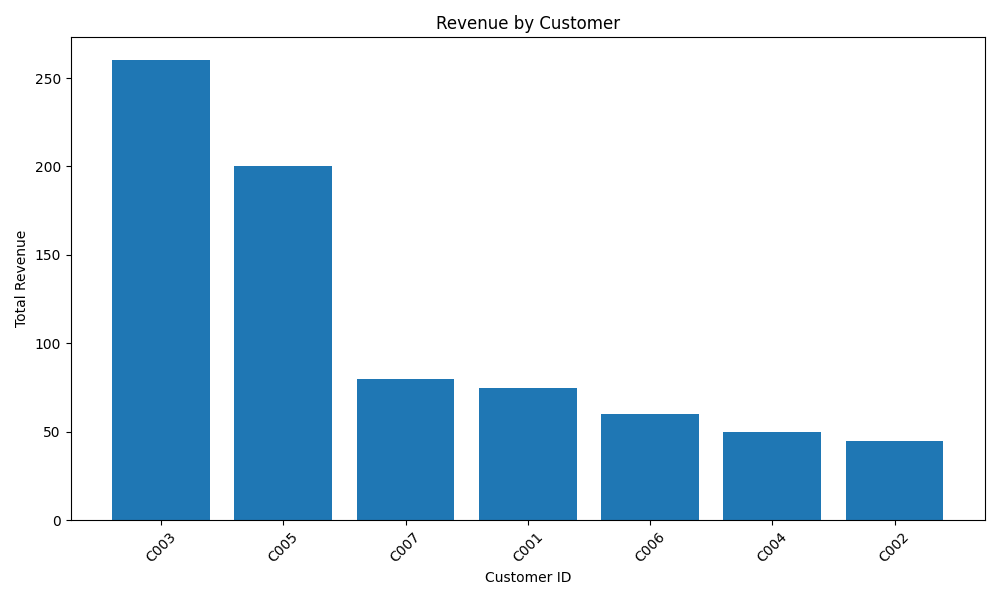

# Sales Performance Analysis

## Overview
This project explores a small sales dataset to understand which products, categories, and customers generate the most revenue.

The main goal was to practice data analysis using Python, SQL, and SQLite while approaching the project from a business perspective.

## Business Question
Which products and categories generate the most revenue, and which ones seem to perform below expectations?

## Tools
- Python
- Pandas
- SQLite
- SQL
- Matplotlib

## Dataset
The dataset contains fictional sales transaction data with the following fields:

- Order ID
- Order Date
- Customer ID
- Product Name
- Category
- Quantity
- Price

## What I Analyzed
This project includes SQL-based analysis to answer questions such as:

- Which products generate the most revenue?
- Which categories contribute the most to total sales?
- Which products sell the most units?
- Which customers generate the highest revenue?
- How does revenue change over time?

## Key Insights
- Some products generate much more revenue than others.
- The highest-selling products are not always the ones that bring in the most money.
- A small group of customers contributes a large share of total revenue.
- Revenue changes over time, with visible monthly ups and downs.
- Category-level performance helps show where the business is strongest.

## Executive Summary
This analysis was built to simulate a simple business case: understanding what is driving sales performance.

The results show that revenue is not evenly distributed across products, categories, or customers. A few products and customer segments appear to contribute a larger share of sales, while monthly revenue also shows some variation over time.

From a business point of view, this kind of analysis can help support decisions related to:

- product focus
- category strategy
- customer segmentation
- future sales optimization

Overall, this project helped me practice how to move from raw transactional data to clear and useful business insights.

## Files
- `main.py` → main analysis script
- `data/sales_data.csv` → dataset used in the project
- `sales_database.db` → SQLite database generated from the dataset
- `images/` → saved charts used in this README
- `README.md` → project documentation

## Visualizations

### Revenue by Product

### Revenue by Category

### Revenue by Customer

### Monthly Revenue Trend

## Additional Notes

For a more detailed explanation of the analytical decisions and reasoning behind this project, see:

- [Analysis Decisions and Reasoning](analysis_decisions.md)

## Next Steps
Possible improvements for this project:

- Add profit margin analysis
- Compare revenue vs. units sold more deeply
- Build an interactive dashboard
- Add a short recommendation section based on the findings