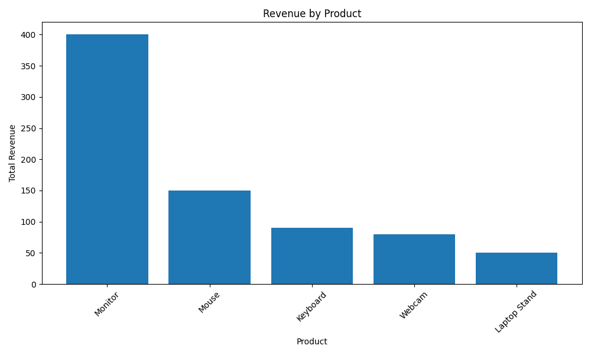
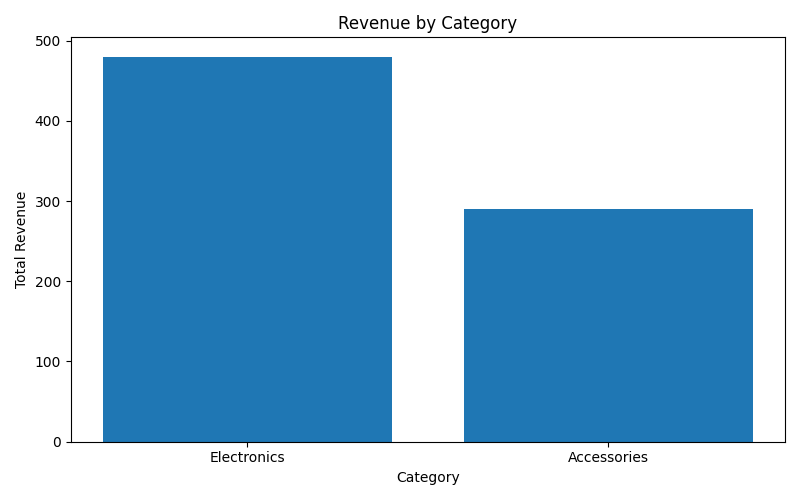
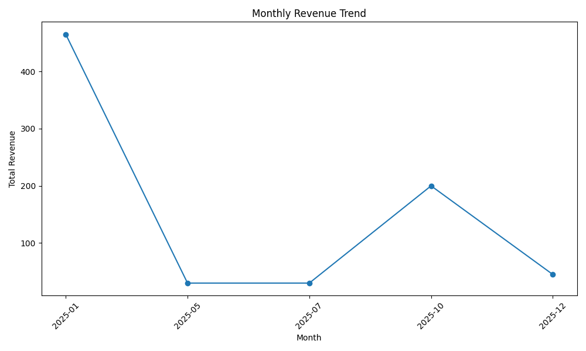

# Sales Performance Analysis

## Overview

This project analyzes sales transaction data to understand which products, categories, and customers generate the most revenue.

The project was expanded to include a structured ETL pipeline, SQL-based analysis, and an interactive Power BI dashboard, allowing a more complete end-to-end data workflow.

A basic ETL pipeline was implemented to structure the data into raw and processed layers.

The main goal was to simulate a real-world data analysis process, moving from raw data to business insights.

---

## Business Question

Which products and categories generate the most revenue, and which ones seem to perform below expectations?

Additionally:

* How does revenue evolve over time?
* Which customers contribute the most to total revenue?

---

## Tools

* Python
* Pandas
* SQL
* SQLite
* Power BI

---

## Dataset

The dataset contains fictional sales transaction data with fields such as:

* Order ID
* Order Date
* Customer ID
* Product Name
* Category
* Quantity
* Price

The data is organized into:

* **Raw data** (`data/raw/`)
* **Processed data** (`data/processed/`) after cleaning and transformation

---

## What I Analyzed

This project includes both SQL and Python-based analysis, along with dashboard visualization, to answer questions such as:

* Which products generate the most revenue?
* Which categories contribute the most to total sales?
* Which products sell the most units?
* Which customers generate the highest revenue?
* How does revenue change over time?

---

## Key Insights

* Revenue shows an overall upward trend with some fluctuations, suggesting possible seasonality.
* A small group of customers contributes a significant share of total revenue.
* Sales are concentrated in a limited number of products and categories.
* High-volume products are not always the highest revenue generators.
* There is an opportunity to improve underperforming products and diversify revenue streams.

---

## Executive Summary

This project simulates a real-world business scenario: understanding what drives sales performance.

A complete workflow was implemented, including:

* Data extraction and cleaning (ETL pipeline)
* SQL-based exploration
* Data visualization using Power BI

The analysis shows that revenue is not evenly distributed across products, categories, or customers. A small subset of elements drives a large portion of total revenue, while trends over time reveal variability in sales performance.

From a business perspective, this type of analysis can support decisions related to:

* Product strategy
* Category performance optimization
* Customer segmentation
* Revenue growth opportunities

---

## Files

* `scripts/etl.py` → ETL pipeline (data extraction, cleaning, transformation)
* `data/raw/sales_raw.csv` → original dataset
* `data/processed/sales_clean.csv` → cleaned dataset
* `dashboard/sales_dashboard.pbix` → Power BI dashboard
* `sql/queries.sql` → SQL queries used for analysis
* `reports/images/` → exploratory analysis visualizations (Python)
* `analysis_decisions.md` → explanation of analytical decisions
* `README.md` → project documentation

---

## Visualizations

### Power BI Dashboard

The final dashboard includes:

* Revenue KPIs
* Monthly revenue trend
* Revenue by category
* Top customers
* Top-performing products

*(Dashboard available in `/dashboard` folder)*

---

### Exploratory Analysis (Python)

### Revenue by Product

### Revenue by Category

### Revenue by Customer

### Monthly Revenue Trend

---

## Additional Notes

For a more detailed explanation of the analytical decisions and reasoning behind this project, see:

* [Analysis Decisions and Reasoning](analysis_decisions.md)

---

## Next Steps

Possible improvements for this project:

* Automate the existing ETL pipeline (e.g., scheduled or incremental runs)
* Publish the Power BI dashboard to Power BI Service for online sharing
* Enhance dashboard interactivity with slicers and drill-down capabilities
* Incorporate additional business metrics such as profit and margins
* Improve the data model to support more advanced and scalable analysis

---
